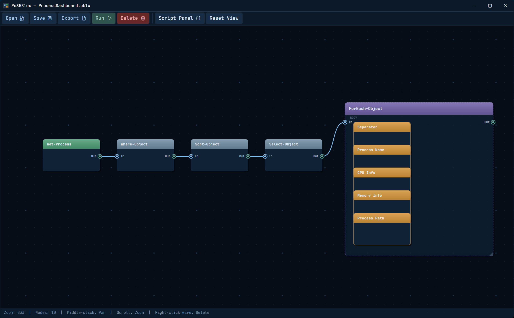

<p align="center">
  
</p>

<p align="center">
  A visual node-graph editor for building PowerShell scripts. Drag, connect, run.
</p>

<p align="center">
  
  
  
  
</p>

---

## What is PoSHBlox?

PoSHBlox lets you visually compose PowerShell scripts by wiring together nodes on a canvas. Each node represents a cmdlet, control-flow block, or custom script fragment. Connections between nodes define the data pipeline. When you're done, export a clean `.ps1` file.

<p align="center">
  
</p>

### Features

- **Node palette** with 50+ built-in cmdlet templates across 9 categories (File/Folder, Process/Service, Registry, Network/Remote, String/Data, Output, Control Flow, Custom, Annotation)
- **Control flow containers** -- If/Else, ForEach, Try/Catch, While loops, Functions, and Labels -- with support for nesting containers inside containers
- **Live script preview** and one-click Run in a PowerShell 5.1 window
- **Pipeline-aware code generation** -- chains piped cmdlets, assigns variables at branch points, and detects cycles
- **Module import** -- import cmdlets from installed PowerShell modules to extend the palette
- **10 sample projects** included to demonstrate common patterns
- **Keyboard shortcuts** -- P (palette), F5 (run), Ctrl+S (save), Ctrl+E (export), Del (delete node), / (search), and more
- **Dark theme** with a custom node-graph renderer (pan, zoom, Bezier wires)

## Getting Started

### Prerequisites

- [.NET 10 SDK](https://dotnet.microsoft.com/download/dotnet/10.0)

### Build & Run

```bash
git clone https://github.com/obselate/PoSHBlox.git
cd PoSHBlox
dotnet run
```

### Publish

Build a self-contained single-file executable:

```bash
dotnet publish -c Release -r win-x64 --self-contained
```

Output lands in `bin/Release/net10.0/win-x64/publish/` — just the exe, Templates, and Scripts folders.

## How It Works

1. **Add nodes** from the palette
2. **Connect** output ports to input ports by dragging wires
3. **Configure** parameters in the right-side properties panel
4. **Preview** the generated script, then **Run** or **Save** as `.ps1`

## License

GNU AGPL v3 — see [LICENSE](LICENSE)
