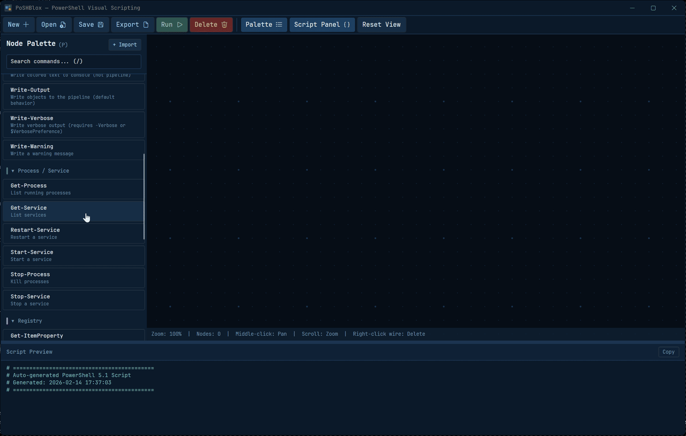

<p align="center">
  
</p>

<p align="center">
  A visual node-graph editor for building PowerShell scripts. Drag, connect, run.
</p>

<p align="center">
  
  
  
  
</p>

---

## What is PoSHBlox?

PoSHBlox lets you visually compose PowerShell scripts by wiring together nodes on a canvas. Each node represents a cmdlet, control-flow block, or custom script fragment. Connections between nodes define the data pipeline. When you're done, export a clean `.ps1` file.

<p align="center">
  
</p>

### Features

- **Node palette** with 85+ built-in cmdlet templates across 12 categories (File/Folder, Process/Service, Registry, Network/Remote, String/Data, Output, Utility/Date, Variable/Module, Security, Control Flow, Custom, Annotation)
- **Control flow containers** -- If/Else, ForEach, Try/Catch, While loops, Functions, and Labels -- with support for nesting containers inside containers
- **Live script preview** and one-click Run in a PowerShell window — prefers pwsh 7+ when installed, falls back to Windows PowerShell 5.1
- **Pipeline-aware code generation** -- chains piped cmdlets, assigns variables at branch points, and detects cycles
- **Module import** -- import cmdlets from installed PowerShell modules to extend the palette
- **Keyboard shortcuts** -- P (palette), F5 (run), Ctrl+S (save), Ctrl+E (export), Del (delete node), / (search), and more
- **Dark theme** with a custom node-graph renderer (pan, zoom, Bezier wires)

## Getting Started

### Prerequisites

- [.NET 10 SDK](https://dotnet.microsoft.com/download/dotnet/10.0)

### Build & Run

```bash
git clone https://github.com/obselate/PoSHBlox.git
cd PoSHBlox
dotnet run
```

### Try a sample

The repo ships with a handful of ready-to-open `.pblx` files under
`Samples/`. From the running app, **Open** one (or Ctrl+O) to see a
working graph — 01-csv-cleanup, 02-show-psversion, 03-safe-env, and
04-filesize-compare are progressively more involved. Hit **Run** to
execute, or toggle the script preview (Ctrl+P) to see the generated
PowerShell.

### Publish

Build a self-contained single-file executable:

```bash
dotnet publish -c Release -r win-x64 --self-contained
```

Output lands in `bin/Release/net10.0/win-x64/publish/` — just the exe, Templates, and Scripts folders.

### Download a prebuilt build

Every push to every branch builds a Windows self-contained single-file
executable through [GitHub Actions](../../actions/workflows/build.yml). The
build bundles the `.exe` with `Templates/` and `Scripts/` into a `.zip`
(needed at runtime). Two places to grab it:

- **[Releases](../../releases)** — each branch has a rolling pre-release
  named `Branch build: <branch-name>` with the latest `.zip` attached.
  Overwritten on every push to that branch; delete the branch to retire it.
  Tagged releases (`v*`) appear as proper releases with generated notes.
- **[Actions tab](../../actions/workflows/build.yml)** — every run (including
  PR builds) uploads its `.zip` as a 30-day artifact, linked from the run page.

Extract, run `PoSHBlox.exe`. No .NET install required on the target machine.

Stamped version follows `<baseFromCsproj>.<runNumber>` for branch builds and
the tag name for releases; `InformationalVersion` additionally includes the
commit SHA and branch slug (visible in Properties → Details on the file).

### Regenerating Builtin catalogs

The shipped `Templates/Builtin/*.json` can be regenerated from live
PowerShell modules via the CLI. From the repo root on Windows:

```powershell
# Pipe to Out-Host so the WinExe's output is flushed to the shell.
.\bin\Debug\net10.0\PoSHBlox.exe --regen-manifest scripts\builtin-catalog.json 2>&1 | Out-Host

# Dry-run first to preview:
.\bin\Debug\net10.0\PoSHBlox.exe --regen-manifest scripts\builtin-catalog.json --dry-run 2>&1 | Out-Host
```

`scripts/builtin-catalog.json` is the reference manifest listing each
output file, its category, and which cmdlets (from which modules) should
populate it. Curated per-parameter defaults are preserved across runs.

> **Why the `| Out-Host`?** The app ships as a `WinExe` so a double-click
> doesn't flash a console window. That means PowerShell detaches stdout
> when run directly; the CLI modes attach to the parent console on
> startup, but piping forces PS to wait for the pipeline to finish before
> returning the prompt so output doesn't interleave awkwardly.

## How It Works

1. **Add nodes** from the palette
2. **Connect** output ports to input ports by dragging wires
3. **Configure** parameters in the right-side properties panel
4. **Preview** the generated script, then **Run** or **Save** as `.ps1`

## License

GNU AGPL v3 — see [LICENSE](LICENSE)
